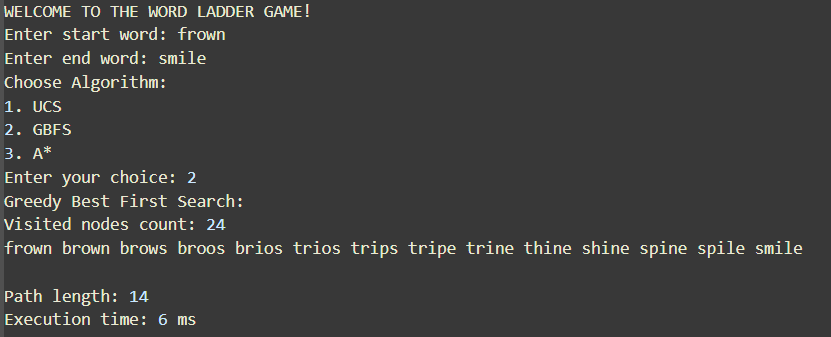
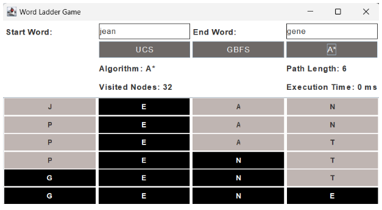

<br />
<div align="center">
  <h1 align="center">Tugas Kecil 3 IF2211 Strategi Algoritma</h1>

  <p> Dibuat oleh : 13522085 - Zahira Dina Amalia
    <br />
    <br />
  </p>
</div>

## Table of Contents
* [Penjelasan Singkat](#penjelasan-singkat)
* [Dependansi](#dependansi)
* [Struktur Program](#struktur-program)
* [Cara Penggunaan](#cara-penggunaan)
<!-- * [License](#license) -->

## Penjelasan Singkat

Program ini dibuat berdasarkan spesifikasi dari tugas kecil 3 dari mata kuliah IF2211 Strategi Algoritma yang terdapat pada tautan berikut, <a href= https://informatika.stei.itb.ac.id/~rinaldi.munir/Stmik/2023-2024/Tucil3-2024.pdf> Spesifikasi Tugas Kecil 3</a>.

Program yang dibuat akan menerima input berupa dua kata, yaitu start word dan end word, dari pengguna. Program kemudian akan mencari rantai kata yang menghubungkan start word dengan end word dengan aturan bahwa setiap kata dalam rantai harus berbeda dari kata sebelumnya hanya dalam satu huruf. Untuk mencari solusi, program akan menggunakan algoritma pencarian yang tepat, seperti BFS (Breadth-First Search) atau A* (A Star Search), untuk menemukan jalur terpendek antara kedua kata. Selama pencarian, program akan memeriksa apakah setiap kata yang dieksplorasi sesuai dengan aturan permainan.

Setelah menemukan solusi, program akan mencetak rantai kata yang membentuk jalur dari start word ke end word, serta memberikan informasi tambahan seperti jumlah langkah yang dibutuhkan atau jumlah kata dalam rantai. Jika solusi tidak ditemukan, program akan memberikan pesan bahwa tidak ada solusi yang ditemukan. Selain itu, program juga dapat memberikan opsi kepada pengguna untuk memilih algoritma pencarian yang ingin digunakan.


### Dependansi
Program ini menggunakan bahasa <a href=https://www.java.com/en/> Java </a> sebagai dependansi utama dalam pengembangannya pilihlah JDK.


## Struktur Program
```
│
├── bin
│   ├── Astar.class
│   ├── Astar$Node.class
│   ├── GBFS.class
│   ├── Pair.class
│   ├── UCS.class
│   ├── UCS$Node.class
│   ├── WordChecker.class
│   ├── WordLadderGame.class
│   ├── WordLadderGUI.class
│   └── words.txt
│ 
├── doc
│   └── Tucil3_13522085.pdf
│   
├── src
│   ├── bin
│   │   ├── Astar.class
│   │   ├── Astar$Node.class
│   │   ├── GBFS.class
│   │   ├── Pair.class
│   │   ├── UCS.class
│   │   ├── UCS$Node.class
│   │   └── WordLadderGame.class
│   │ 
│   ├── Astar.java
│   ├── GBFS.java
│   ├── Pair.java
│   ├── UCS.java
│   ├── WordChecker.java
│   ├── WordLadderGame.java
│   ├── WordLadderGUI.java
│   └── words.txt
│
├── test
│   ├── datatest.txt
│   ├── tc1_frown-smile.txt
│   ├── tc2_jean-gene.txt
│   ├── tc3_veep-exec.txt
│   ├── tc4_strong-dreams.txt
│   ├── tc5_grass-roots.txt
│   ├── tc6_pray-amen.txt
│   └── tc7_edge_cases.txt
│
├── .gitattributes
├── README.md
├── run-CLI.bat
├── run-CLI.sh
├── run-GUI.bat
└── run-CLI.sh

```


## Cara Menjalankan Program

Program dapat digunakan dengan melakukan penginstalan dengan mengikuti langkah-langkah di bawah ini.

1. Lakukan `git clone` pada repository ini
   ```sh
   git clone https://github.com/hiirrs/Tucil3_13522085.git
   ```
2. Program ini memiliki dua macam tampilan yaitu Command Line Interface (CLI) dan Graphical User Interface (GUI). 
* Untuk menjalankan CLI tuliskan pada terminal dengan directory repository ini
- pada Linux/macOS
   ```sh
   ./run-CLI.sh
   ```
- pada Windows
   ```sh
   ./run-CLI.bat
   ``` 
* Untuk menjalankan GUI tuliskan pada terminal dengan directory repository ini
- pada Linux/macOS
   ```sh
   ./run-GUI.sh
   ```
- pada Windows
   ```sh
   ./run-GUI.bat
   ``` 

## Cara Pemakaian Program
- Masukkan start word dan end word. Program akan memeriksa kata-kata apakah panjangnya sama dan terdapat pada data kata-kata pada `words.txt`. 
- Lalu, pilihlah macam algoritma yang akan digunakan untuk pencarian
- Program kemudian akan memulai pencarian dan memperlihatkan jumlah simpul yang dilalui, panjang jalur kata, dan waktu eksekusi.

## Screenshot Contoh Pemakaian
### CLI

### GUI
